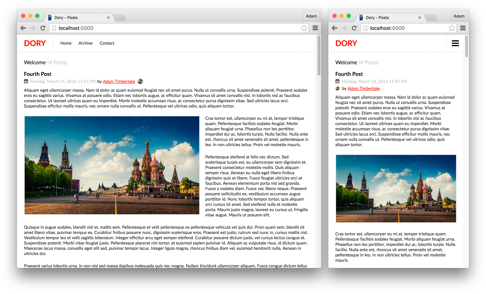

> Dory should have a blog to write before she forgets. 
> So don't be like her else you'll have many regrets. 
> And don't tell Dory she needs the internets.

&nbsp;

&nbsp;

**Dory** is a responsive, [universal](https://medium.com/@mjackson/universal-javascript-4761051b7ae9#.z4idbohho), [GitHub collaborated](#collaboration) blogging platform built on React and powered by Express. By combining awesome features such as automatic RSS generation, [HTML5 offline support](https://developer.mozilla.org/en-US/docs/Web/API/Service_Worker_API), push notifications, with a powerful development environment using [hot reloading](https://github.com/gaearon/react-hot-loader), SASS and Markdown, Dory allows developers to quickly dive into the depths of blogging.

---

## Documentation

Getting started with Dory is a fairly straightforward task &mdash; however we have broken up the various steps to make this even easier. By step three you will be publishing posts to Heroku.

1. Getting Started
2. Travis &amp; Heroku
3. Publishing
4. GitHub Authentication
4. [Redis Authentication](documentation/REDIS.md)
5. Change Settings

## Features

* Provides a [universal JavaScript](https://medium.com/@mjackson/universal-javascript-4761051b7ae9) environment using React and Express;
* Integrates native [Markdown](https://github.com/evilstreak/markdown-js) support for generating blog posts;
* Instantaneous publishing to [Heroku](https://www.heroku.com/) for each post via [Travis CI](https://travis-ci.org/);
* Supports [Webpack Hot Reloading](https://github.com/webpack/docs/wiki/hot-module-replacement-with-webpack) for rapid development;
* Generates a valid [RSS](https://en.wikipedia.org/wiki/RSS) feed when you publish articles;

### Upcoming

* Automatically pings via [Ping-o-matic](http://pingomatic.com/) to notify of updates;
* Generates a [`sitemap.xml`](http://www.sitemaps.org/protocol.html) with automatic XSLT styling;
* Integrates [Disqus](https://disqus.com/) for post commenting when enabled via `dory.yml`;
* Utilises HTML5 [`ServiceWorker`](https://developer.mozilla.org/en-US/docs/Web/API/Service_Worker_API) for offline support;
* Seamlessly applies background sync for posting comments when offline;
* Implements the HTML5 [Push API](https://developer.mozilla.org/en/docs/Web/API/Push_API) for notifying users of added posts;
* Allows integration of generic pages &ndash; such as about and contact us;
* [Have an idea?](https://github.com/Wildhoney/Dory/issues/new)

