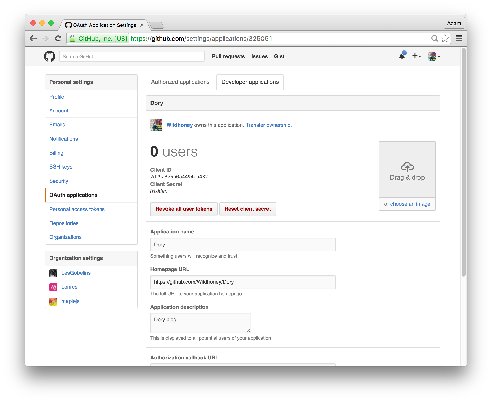
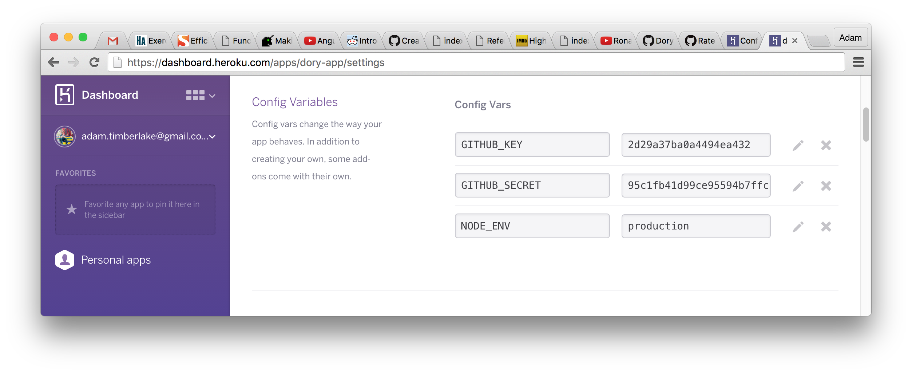

# GitHub

Dory uses GitHub to obtain the first and last commit of each post in the `public/posts` directory &mdash; as well as the author of the first commit.

By not authenticating with GitHub you are subject to the [default rate limits](https://developer.github.com/v3/rate_limit/) and therefore authenticating will substantially increase the amount of requests you can make per hour to GitHub.

Authenticating to GitHub requires adding two environment variables &mdash; `GITHUB_KEY` and `GITHUB_SECRET`.

## Setting up GitHub.com

For your cloned Dory repository you'll need to access OAuth applications and select the [Developer applications](https://github.com/settings/developers) tab from the top. From within there you can **Register new application** where you fill in a form about the application &mdash; and finally be issued with a **Client ID** and **Client Secret**.

Once you have configured Dory with OAuth on GitHub, take the **Client ID** and **Client Secret** information and create the two required [environment variables on Heroku](https://devcenter.heroku.com/articles/config-vars). You should do the same for your `localhost` so as not to hit the default rate limits when developing.

## Summary

* [Use `/rate-limit`](https://api.github.com/rate_limit) to check remaining requests when not authenticated;
* Error thrown when rate limit exceeded and no posts will be loaded;
* Use [Redis to cache requests](REDIS.md) to GitHub for increased performance;
